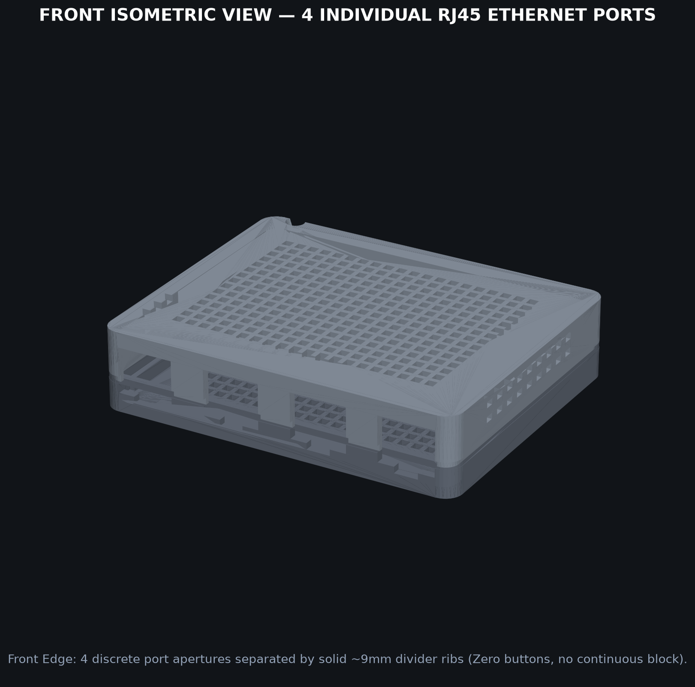
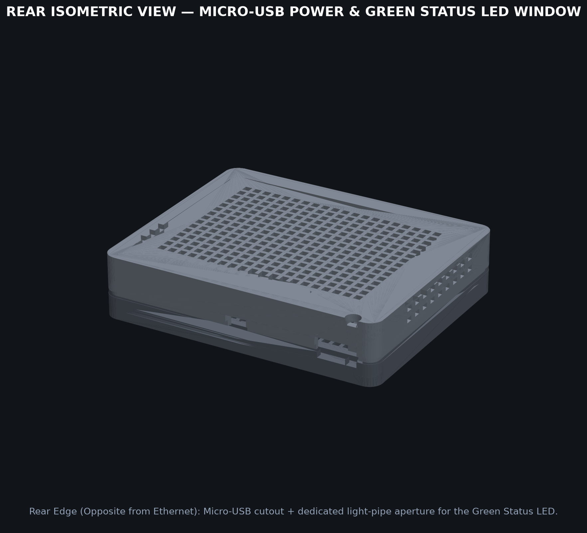
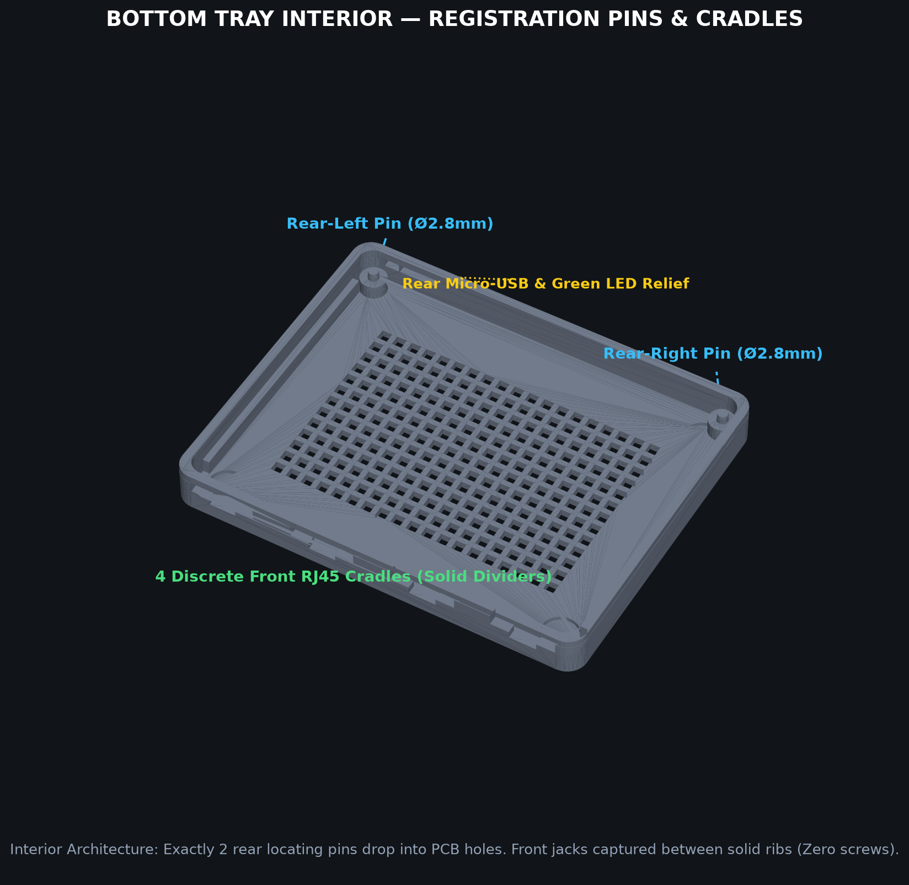
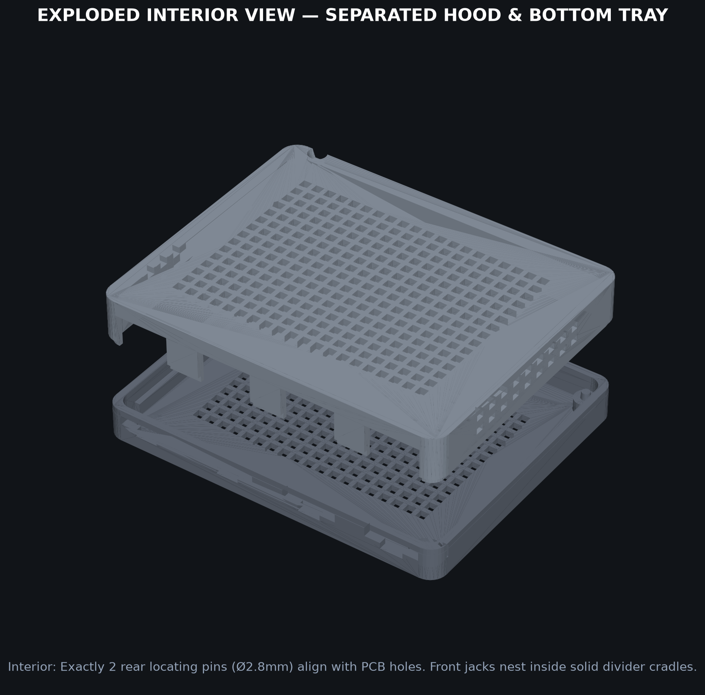
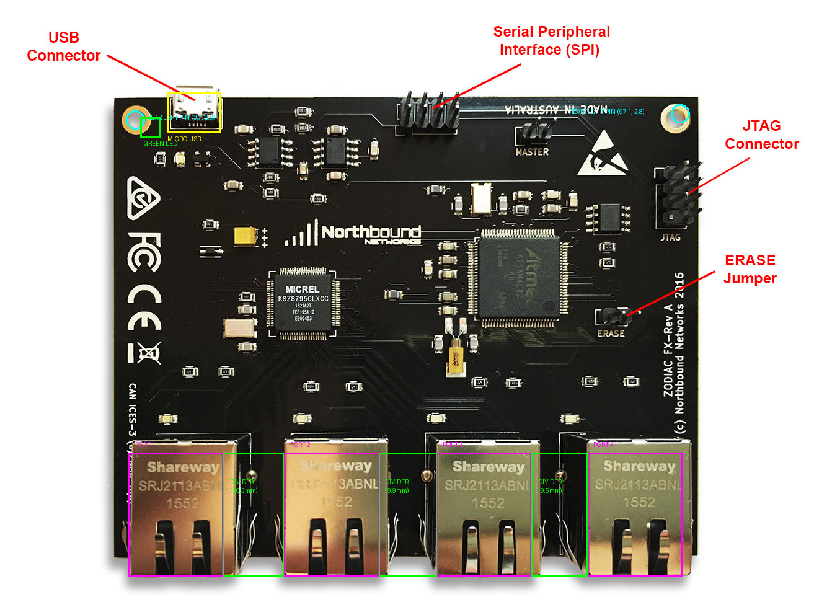
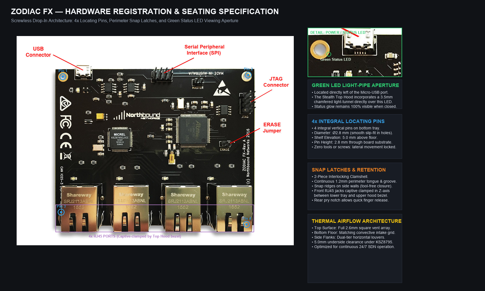
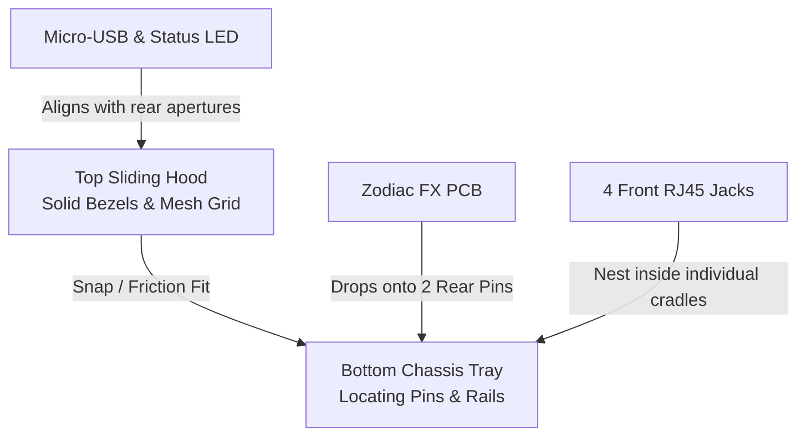

# Zodiac FX Switch — Technical Specification & Stealth 3D Casing Module (Screenless Edition)

## Executive Summary
This document provides the complete hardware specification of the **Northbound Networks Zodiac FX** OpenFlow SDN switch (derived from the official [User Guide PDF](https://movingpackets.net/assets/pdf/ZodiacFX_UserGuide_0317.pdf), high-resolution PCB imaging, and component analysis) and details the mechanical and aesthetic design of a custom **3D printable casing module** engineered for optimal fit, high convective ventilation, and zero-screw tool-free assembly on a **Prusa MK4** or **Prusa XL**.

All production CAD models, STL meshes, 3MF slicer projects, and OpenSCAD parametric sources are available in the repository at [`/hardware/cad/`](file:///Users/andymorven/git/zodiac/hardware/cad/).

---

## 1. Product Architecture & Engineering CAD Renders (All Angles)

### 1.1 Front Isometric View: 4 Individual RJ45 Ethernet Ports
The front edge features **4 discrete, individually framed RJ45 port apertures** separated by **~9.5 mm solid structural divider ribs** (matching the 4 standalone Shareway SRJ2113ABNL jacks, rather than a single contiguous gang-block):



- **Discrete Port Bezels**: Each port cutout is sized at $16.6\text{ mm (W)}\times 14.2\text{ mm (H)}$ with lower latch-relief notches for snag-free patch cable removal.
- **Structural Integrity**: Continuous vertical divider ribs between each port prevent cable cross-snagging and add rigid Z-axis support.
- **Clean Buttonless Face**: No extraneous buttons or toggles on the front panel.

---

### 1.2 Rear Isometric View: Micro-USB Power & Green Status LED Window
The power source and Ethernet ports **do not face the same side**. The Micro-USB port and the onboard status indicator are located strictly on the **rear edge**:



- **Micro-USB Receptacle Cutout**: Centered at $X = -36.35\text{ mm}$, sized $10.5\text{ mm}\times 6.0\text{ mm}$ to accommodate standard molded USB cable boots.
- **Dedicated Green Status LED Viewing Window**: The Zodiac FX has a surface-mount green power/status LED positioned immediately adjacent to the Micro-USB port ($X = -43.8\text{ mm}$). A dedicated $4.0\text{ mm}\times 4.0\text{ mm}$ aperture with an upward $45^\circ$ chamfered light tunnel makes this indicator clearly visible when the case is fully closed.
- **Tool-Free Finger Pry Notch**: A centered notch on the rear parting line facilitates simple thumb-release of the top hood.

---

### 1.3 Bottom Tray Interior: 2 Rear Locating Pins & Front Jack Cradles
Top-down view of the bottom tray showing the internal mounting architecture:



- **Only Two PCB Mounting Holes**: On the physical Zodiac FX board, mounting holes exist **only at the two rear corners** (the front edge is fully occupied by the RJ45 jacks).
  - **Rear-Left Pin**: $X = -46.3\text{ mm}$, $Y = +36.2\text{ mm}$ ($3.7\text{ mm}$ from left edge, $3.8\text{ mm}$ from rear edge).
  - **Rear-Right Pin**: $X = +47.1\text{ mm}$, $Y = +37.2\text{ mm}$ ($2.9\text{ mm}$ from right edge, $2.8\text{ mm}$ from rear edge).
- **Pin Dimensions**: Ø2.8 mm × 2.8 mm tall pins atop 5.0 mm riser pillars, providing a smooth slip-fit into the board's Ø3.2 mm plated holes.
- **Zero PCB Screws**: The board is placed onto the tray; the 2 rear pins lock horizontal/lateral motion, while the 4 front cradles capture the jacks.
- **Convective Cross-Flow**: High-density $2.6\text{ mm}$ square ventilation perforations across the floor with recessed pockets for 4 rubber feet.

---

### 1.4 Exploded Assembly View: Separated Hood & Bottom Tray
Visualizing the two-piece clamshell mating mechanism:



- **Interlocking Perimeter Tongue-and-Groove**: A $2.5\text{ mm}$ vertical stepped tongue on the bottom tray engages a corresponding recess inside the top hood for light-tight alignment.
- **Zero Fasteners Required**: The top hood slides down and friction-locks over the tray and PCB.

---

### 1.5 Photographic Ground-Truth Verification Overlay
Direct dimensional mapping against the official Northbound Networks Zodiac FX Rev A board photograph:



- **Magenta Boxes**: The 4 discrete Shareway SRJ2113ABNL RJ45 jacks ($16.0\text{ mm}$ width, $16.6\text{ mm}$ aperture clearance).
- **Green Boxes**: Solid structural divider ribs ($10.3\text{ mm}$, $9.9\text{ mm}$, $9.5\text{ mm}$ spacing between individual jacks).
- **Cyan Circles**: The **only two PCB mounting holes** on the physical board ($Ø3.2\text{ mm}$, located at the rear corners).
- **Yellow Box**: Micro-USB receptacle ($10.5\text{ mm}\times 6.0\text{ mm}$ cutout at $X = -36.35\text{ mm}$).
- **Small Green Box**: Green status LED ($X = -43.8\text{ mm}$, $5.1\text{ mm}$ from rear edge).

---

### 1.6 Hardware Registration Blueprint
Component-level dimensional blueprint overlaid on the physical board:



---

## 2. Zodiac FX Switch: Technical Specifications & Board Dimensions

### 2.1 Mechanical & Electrical Dimensions

| Parameter | Dimension / Value | Engineering Notes |
| :--- | :--- | :--- |
| **PCB Dimensions** | **100.0 mm × 80.0 mm** | 1.6 mm FR4 double-sided black solder mask |
| **Total Assembly Height** | **15.5 mm - 16.0 mm** | Solder tail tips to top of RJ45 metal jack shells |
| **RJ45 Jack Height** | **13.8 mm** above PCB | Shareway SRJ2113ABNL with internal magnetics & status LEDs |
| **RJ45 Jack Width** | **16.0 mm** per jack | 4 independent metal-shielded single jacks (not a gang-block) |
| **RJ45 Aperture Clearances** | **16.6 mm (W) × 14.2 mm (H)** | 0.3 mm perimeter clearance for smooth fit |
| **Divider Rib Thickness** | **9.2 mm - 9.9 mm** | Solid structural walls between individual ports |
| **Mounting Holes** | **2× Ø3.2 mm plated holes** | **Rear corners only**: Left ($X = -46.3, Y = +36.2$), Right ($X = +47.1, Y = +37.2$) |
| **Power Connector** | **Micro-USB Type-B** | Edge-mounted at rear ($X = -36.35\text{ mm}$), opposite from RJ45 |
| **Status LED** | **Green 0805 SMD LED** | Located at $X = -43.8\text{ mm}$, $5.1\text{ mm}$ from rear edge |
| **Power Control** | **Auto-Boot** | Boots automatically upon 5V USB connection; zero power switch |
| **Power Consumption** | **5V DC @ 250 mA** (~1.25 W) | Low thermal load; passive cross-flow cooling is optimal |
| **Operating Temp** | 0°C to 50°C | Desktop / edge SDN rack environment |

> [!IMPORTANT]
> The Zodiac FX PCB has **strictly two mounting holes**, located at the rear corners. The front edge has no mounting holes because Port 1 starts $2.55\text{ mm}$ from the left board edge and Port 4 ends $1.06\text{ mm}$ from the right edge. Front retention is accomplished by the 4 precision bottom tray cradles and top hood divider ribs.

### 2.2 Functional Architecture & Port Layout

```
                        TOP / REAR EDGE
     [Hole]  [LED] [Micro-USB]    [SPI 2x4]   [Master]         [Hole]
       O      *       [==]         :: ::         ::              O
    +-------------------------------------------------------------+
    |                                                             |
    |  Power Reg.                                         [JTAG]  |
    |                                                     :::::   |
    |                                                             |
    |           [KSZ8795CLXCC]            [ATSAM4E8C]             |
    |            Switch IC                  MCU                   |
    |                                                             |
    |                                                   [ERASE]   |
    |                                                     ::      |
    |   [Port 1]         [Port 2]         [Port 3]       [Port 4] |
    +=============================================================+
        OpenFlow         OpenFlow         OpenFlow      Controller
                       BOTTOM / FRONT EDGE
```

- **Ethernet Ports (1–4)**:
  - Ports 1, 2, 3: Designated default **OpenFlow data ports** (VLAN 100).
  - Port 4: Default **OpenFlow Controller / Management port** (VLAN 200, IP `10.0.1.99`).
- **MCU**: Microchip Atmel ATSAM4E8C (ARM Cortex-M4 @ 120 MHz, 512 KB Flash, 128 KB SRAM).
- **Switch Fabric**: Micrel KSZ8795CLXCC (5-port Layer-2 Fast Ethernet managed switch engine with SPI host link).
- **Micro-USB**: Combined 5V DC power supply input and CDC ACM Serial console (115200 8N1).

---

## 3. Casing Mechanical Architecture

The enclosure is engineered as an **all-black, minimalist, 2-piece clamshell** optimized for tool-free assembly and continuous passive thermal management:



### Component Details

#### 1. Bottom Chassis Tray ([`zodiac_stealth_bottom_tray.stl`](file:///Users/andymorven/git/zodiac/hardware/cad/zodiac_stealth_bottom_tray.stl))
- **Outer Dimensions**: 105.8 mm (W) × 85.8 mm (D) × 11.0 mm (H).
- **Integral Locating Pins**: Exactly 2 precision pillars (Ø6.8 mm base standoff, 5.0 mm height) topped with Ø2.8 mm × 2.8 mm cylindrical pins with chamfered lead-ins.
- **PCB Edge Rails**: 1.8 mm wide side resting shelves supporting the PCB substrate along both flanks.
- **4 Front RJ45 Cradles**: Lower support cutouts holding each jack independently with latch clearance pockets.
- **Rear Micro-USB / LED Step**: Lower half relief cutouts for the rear I/O.
- **Passive Ventilation Matrix**: $2.6\text{ mm}$ square perforations on a $4.0\text{ mm}$ pitch across the base.
- **Rubber Feet Pockets**: 4× cylindrical recesses (Ø9.0 mm × 1.4 mm deep) sized for standard silicone bumpers.
- **Mating Tongue**: Perimeter stepped lip ($1.2\text{ mm}$ step, $2.5\text{ mm}$ tall) for interlocking with the top hood.

#### 2. Top Sliding Hood ([`zodiac_stealth_top_hood.stl`](file:///Users/andymorven/git/zodiac/hardware/cad/zodiac_stealth_top_hood.stl))
- **Outer Dimensions**: 105.8 mm (W) × 85.8 mm (D) × 20.0 mm (H).
- **4 Discrete Front Port Bezels**: Upper halves of the 4 independent RJ45 apertures separated by solid ~9.5 mm divider walls.
- **Rear Micro-USB Aperture**: Clean rectangular notch ($12.5\text{ mm}\times 8.0\text{ mm}$) for standard and low-profile USB cables.
- **Green Status LED Light Tunnel**: Conical chamfered viewing aperture directly over the green LED.
- **Top Airflow Perforations**: Full-coverage $2.6\text{ mm}$ square matrix matching the bottom tray.
- **Side Cross-Flow Louvers**: Dual horizontal ventilation slots along left and right flanks.
- **Support-Free Print Geometry**: Pre-oriented upside down on its flat top surface, requiring **0% support material**.

---

## 4. Bill of Materials (BOM)

| Item | Qty | Specification | Source / Recommendation |
| :--- | :---: | :--- | :--- |
| **Top Hood** | 1 | 3D Printed Part (`zodiac_stealth_top_hood.stl`) | Matte Black PETG or Galaxy Black PLA |
| **Bottom Tray** | 1 | 3D Printed Part (`zodiac_stealth_bottom_tray.stl`) | Matte Black PETG or Galaxy Black PLA |
| **Rubber Bumpers** | 4 | Ø8.0 mm – Ø9.0 mm silicone adhesive feet | 3M Bumpon SJ5302 (Optional) |
| **Fasteners / Screws** | **0** | **Tool-free screwless snap fit** | Not needed |

---

## 5. 3D Printing & Slicing Guidelines (Prusa MK4 & Prusa XL)

### Print Profiles & Slicer Configuration

Both parts have been modeled with strict $45^\circ$ overhang limits and flat reference faces to ensure **100% support-free printing**.

| Parameter | Bottom Tray | Top Hood |
| :--- | :--- | :--- |
| **Print Orientation** | Flat on bottom base | **Flat on top surface (Upside-down)** |
| **Layer Height** | `0.20 mm Structural` | `0.20 mm Structural` (or `0.15 mm Quality`) |
| **Perimeters / Walls** | `4` (ensures 100% solid pins & walls) | `4` |
| **Infill** | `20% - 25% Gyroid` | `20% - 25% Gyroid` |
| **Supports** | **None (Support-Free)** | **None (Support-Free)** |
| **Brim** | Not required | Not required (large contact surface) |
| **Recommended Material** | Prusament PETG (Matte Black) | Prusament PETG (Matte Black) |

### Ready-to-Print Files in Repository

All files are located in [`/hardware/cad/`](file:///Users/andymorven/git/zodiac/hardware/cad/):

1. [**`zodiac_stealth_complete_kit.3mf`**](file:///Users/andymorven/git/zodiac/hardware/cad/zodiac_stealth_complete_kit.3mf) — Multi-body PrusaSlicer project containing both parts arranged and oriented.
2. [**`zodiac_stealth_single_plate.stl`**](file:///Users/andymorven/git/zodiac/hardware/cad/zodiac_stealth_single_plate.stl) — 1-shot print plate ($180\times 100\text{ mm}$ footprint, fits MK4 $250\times 210\text{ mm}$ and XL $360\times 360\text{ mm}$).
3. [**`zodiac_stealth_bottom_tray.stl`**](file:///Users/andymorven/git/zodiac/hardware/cad/zodiac_stealth_bottom_tray.stl) — Bottom tray mesh.
4. [**`zodiac_stealth_top_hood.stl`**](file:///Users/andymorven/git/zodiac/hardware/cad/zodiac_stealth_top_hood.stl) — Top hood mesh (pre-flipped for support-free print).
5. [**`zodiac_stealth_case.scad`**](file:///Users/andymorven/git/zodiac/hardware/cad/zodiac_stealth_case.scad) — Parametric OpenSCAD source file.

---

## 6. Assembly Instructions (Tool-Free)

```
Step 1: Inspect the 3D printed parts. Ensure the two rear locating pins on the bottom tray are clean.
Step 2: (Optional) Stick 4x silicone rubber feet into the circular pockets on the bottom tray underside.
Step 3: Lower the Zodiac FX PCB into the bottom tray at a slight forward angle so the 4 RJ45 jacks
        seat into the front cradles, then drop the rear holes directly onto the 2 locating pins.
Step 4: Verify the PCB is seated flush on the side support rails.
Step 5: Slide the top hood over the bottom tray, pressing gently until the perimeter tongue-and-groove
        interlocks.
Step 6: Plug in the Micro-USB cable at the rear. The green status LED will illuminate through the
        viewing tunnel, and all 4 front RJ45 ports are immediately accessible.
```
